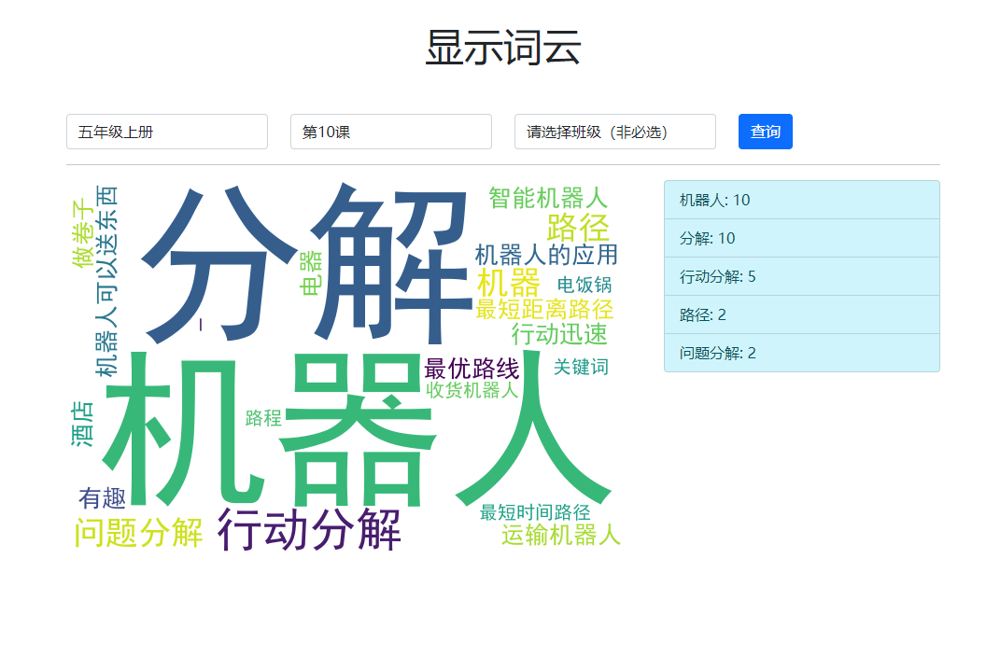

# wordcloud 词云系统

演示页面：[http://106.52.92.136:5005/](http://106.52.92.136:5005/) （暂时开放，随时关闭）

## 简介

通过“提交关键词”页面，获取每一课的关键词提交链接（页面）；填写后，通过“显示词云”页面，显示生成的关键词。

首页功能链接：
- 1.提交关键词：获取每一课的关键词提交链接
- 2.显示词云：显示每个年级每一课的词云结果（也可以按班级分类）
- 3.下载数据：提供下载每个年级或班级的数据链接

## 一、部署环境

### Python 运行环境

```bash
# 1.pip源设置为清华源
pip config set global.index-url https://pypi.tuna.tsinghua.edu.cn/simple

# 2.需要安装的库
pip install flask flask_sqlalchemy gevent pandas openpyxl wordcloud

```

## 二、运行

运行 app.py 后，在浏览器中打开 `http://ip:5005` 进行访问。

词云效果图演示：

